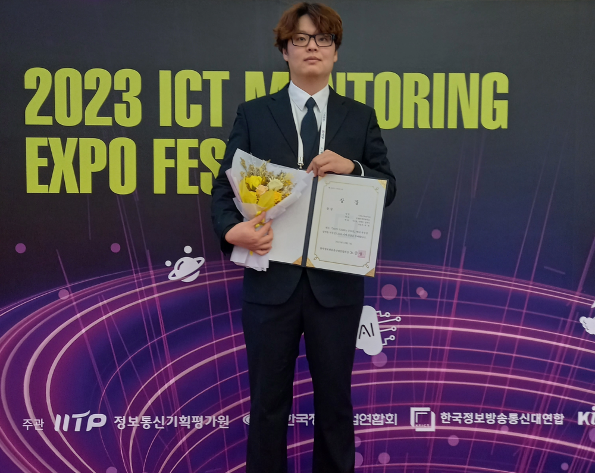
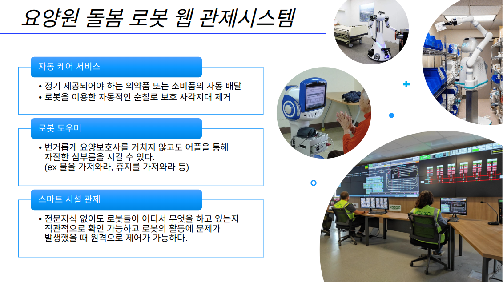
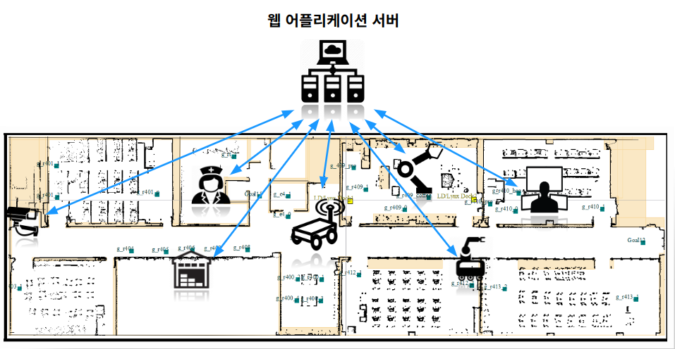
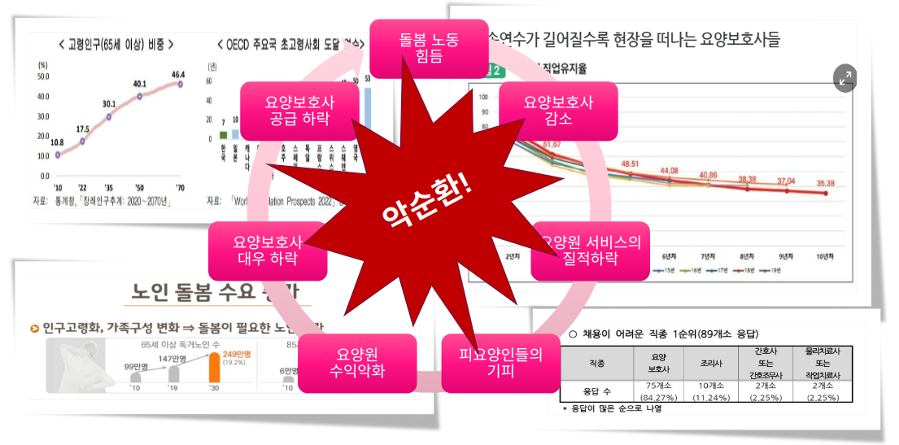
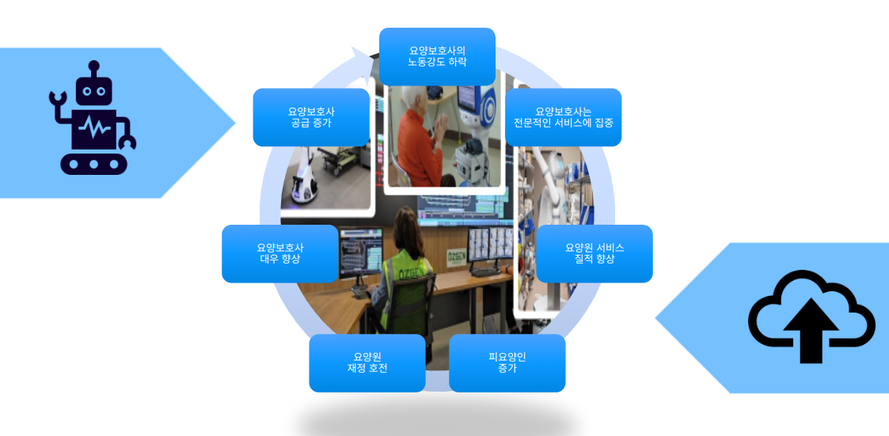
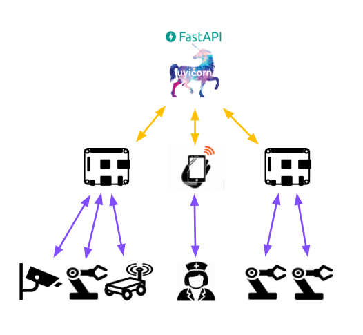
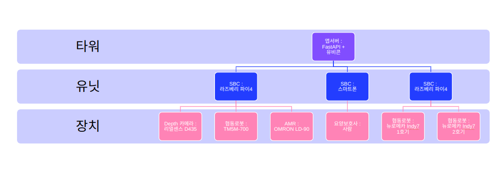
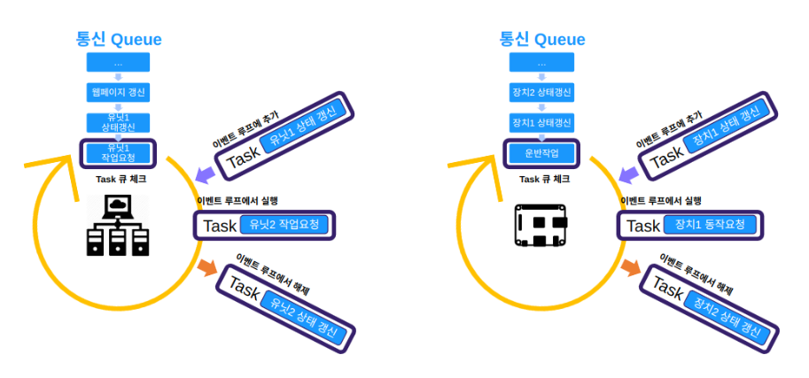

# 스마트 요양원
> 이 프로젝트는 2023 ICT 프로보노 대회용 프로젝트 입니다.

## 결과

## 개요

## 개발의의

## 구조

## 환경
> 이 시스템은 보안, 인권 등을 이유로 인터넷과 직접적으로 연결되지 않은 폐쇄된 서브넷에서 동작하는 것을 전제로 합니다.

* ### 네트워크
    > 이 시스템은 Mesh Wi-Fi 환경에서 설치 및 배포됩니다. 노드 간 원활한 통신을 위해 Mesh 네트워크 구성을 먼저 설정해야 하며, 각 로봇은 Mesh 네트워크에 동적으로 연결됩니다.
* ### 타워
    > 등록된 유닛들을 관리하며, 유닛 하부의 파츠(실제로 작업을 하는 로봇 등)을 직접 관리하지 않습니다.
    * **H/W** : 데스크탑
    * **OS** : Ubuntu 20.04
    * **언어** : python 3.9
    * **프레임워크** : FastAPI
    * **서버** : Uvicorn
    * **DB** : MySQL
* ### 유닛
    > 자신에게 직접 연결된 파츠(로봇, 카메라 등)들을 관리하며, 타워에 의해 관리됩니다.
    * **SBC** : 라즈베리파이4
    * **OS** : Ubuntu 20.04 server
    * **언어** : python 3.9
* ### 파츠
    > 유닛의 관리하에 작동하는 최말단 단말입니다. 타워를 인지하지 않습니다.
    * **모바일 로봇** : 오므론 LD-90
    * **협동 로봇** : TMrobot TM5M-700, 뉴로메카 indy-7

